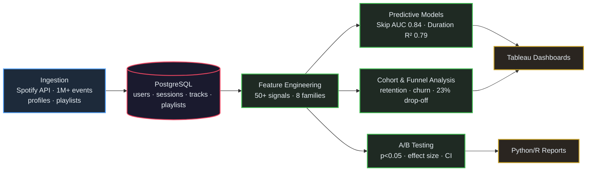

# Music Streaming Analytics & Listener Engagement Platform

End-to-end music streaming analytics platform featuring 50+ engineered user engagement features, skip prediction (AUC: 0.84) and session forecasting (R²: 0.79) models, cohort/funnel analysis, and an A/B testing framework with statistical significance testing—built with Python, R, SQL, and Spotify API integration.


## Live Demo

**Run the interactive dashboard locally:**

```bash
pip install -r requirements.txt
streamlit run app.py
```

Then open http://localhost:8501 in your browser.

### Demo Features:
- **Overview**: Key metrics, user distribution, genre breakdown
- **Engagement**: DAU/MAU trends, hourly/weekly patterns
- **Retention**: Cohort heatmaps, retention curves
- **Skip Analysis**: Skip rates by genre, hour, energy level, funnel analysis
- **A/B Testing**: Interactive experiment simulation
- **ML Models**: Skip predictor demo with ROC curve

## Key Achievements

- **Predictive Modeling**: Logistic regression for skip behavior (AUC: 0.84)
- **Session Forecasting**: Linear regression for session duration (R²: 0.79)
- **Feature Engineering**: 50+ user engagement features
- **Cohort Analysis**: Identified 23% drop-off in playlist completion
- **A/B Testing**: Framework with significance testing (p<0.05)

---

## Architecture



---

## Project Structure

```
music-streaming-analytics/
├── README.md                          # Documentation
├── requirements.txt                   # Python dependencies
├── setup.py                          # Package setup
├── main.py                           # Entry point
├── .env.example                      # Environment template
├── config/
│   └── config.yaml                   # Configuration
├── src/
│   ├── api/
│   │   └── spotify_client.py         # Spotify API integration
│   ├── data/
│   │   ├── data_generator.py         # Synthetic data generation
│   │   └── data_loader.py            # Data loading utilities
│   ├── features/
│   │   └── feature_engineering.py    # 50+ features
│   ├── models/
│   │   ├── skip_predictor.py         # Skip behavior model
│   │   └── session_forecaster.py     # Session duration model
│   ├── analysis/
│   │   ├── cohort_analysis.py        # Cohort analysis
│   │   └── funnel_analysis.py        # Funnel analysis
│   ├── ab_testing/
│   │   └── ab_framework.py           # A/B testing framework
│   ├── visualization/
│   │   └── dashboard_generator.py    # Dashboard generation
│   └── utils/
│       └── helpers.py                # Utilities
├── sql/
│   ├── schema.sql                    # Database schema
│   └── queries.sql                   # Analytics queries
├── r_scripts/
│   ├── cohort_analysis.R
│   ├── ab_testing.R
│   └── visualization.R
├── tests/
│   ├── test_features.py
│   ├── test_models.py
│   └── test_ab_testing.py
└── data/
    ├── raw/
    ├── processed/
    └── interim/
```

---

## Quick Start

### Installation

```bash
# Clone repository
git clone https://github.com/yourusername/music-streaming-analytics.git
cd music-streaming-analytics

# Create virtual environment
python -m venv venv
source venv/bin/activate  # Windows: venv\Scripts\activate

# Install dependencies
pip install -r requirements.txt

# Configure environment
cp .env.example .env
# Edit .env with your Spotify credentials (optional)
```

### Run Pipeline

```bash
# Full pipeline with synthetic data
python main.py --full-pipeline

# Custom data size
python main.py --sessions 1000000 --users 10000

# Run tests
pytest tests/ -v
```

---

## Features Engineering (50+)

| Category | Features |
|----------|----------|
| **Listening Streaks** | current_streak, max_streak, avg_streak, streak_count, active_days |
| **Genre Diversity** | genre_entropy, genre_count, top_genre_ratio, exploration_rate |
| **Playlist Behavior** | completion_rate, skip_rate, playlist_session_ratio |
| **Session Metrics** | avg_duration, track_count, listen_ratio, total_hours |
| **Temporal Patterns** | morning_ratio, evening_ratio, weekend_ratio, peak_hour |
| **Audio Preferences** | tempo_pref, energy_avg, valence_variance, acousticness_pref |
| **Engagement** | days_since_last_listen, avg_daily_sessions, engagement_score |

---

## Testing

```bash
pytest tests/ -v                    # Run all tests
pytest tests/ --cov=src            # With coverage
```

---

## License

MIT License - see [LICENSE](LICENSE) file.
